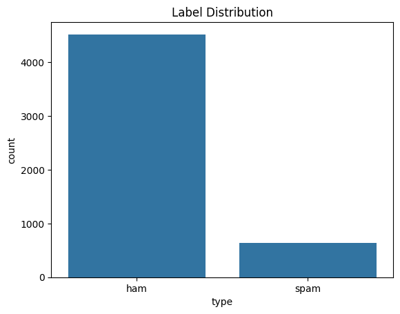
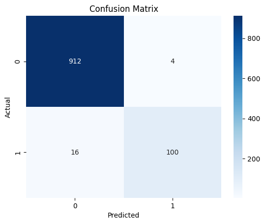

# spam-email-classifier 
# 📧 sms-spam-detection  

# SMS Spam Detection using Machine Learning  

This project builds a **Spam Detection Model** using **Natural Language Processing (NLP)** and **Machine Learning** in Python. The model classifies SMS messages as **Spam** or **Ham (Not Spam)** based on the text content. The project demonstrates the complete machine learning workflow including data preprocessing, visualization, model training, evaluation, and saving the trained model for future use.

---

## Table of Contents
- [Project Overview](#project-overview)
- [Technologies Used](#technologies-used)
- [Dataset Preprocessing](#dataset-preprocessing)
- [Exploratory Data Analysis](#exploratory-data-analysis)
- [Model Training](#model-training)
- [Model Comparison](#model-comparison)
- [Model Evaluation](#model-evaluation)
- [Model Visualization](#model-visualization)
- [Model Saving](#model-saving)
- [Project Structure](#project-structure)
- [How to Run the Project](#how-to-run-the-project)
- [Future Improvements](#future-improvements)
- [License](#license)

---

## Project Overview

The goal of this project is to develop a machine learning model capable of classifying SMS messages as **spam or ham**. The project follows a standard machine learning pipeline including data cleaning, preprocessing, feature extraction using TF-IDF, model training, evaluation, and saving the trained model for reuse.

---

## Technologies Used

- Python  
- Pandas  
- Matplotlib  
- Seaborn  
- Scikit-learn  
- Joblib  

---

## Dataset Preprocessing

Several preprocessing steps were performed to prepare the dataset:

- Removed duplicate messages  
- Checked for missing values  
- Encoded labels:
  - `spam → 1`
  - `ham → 0`

The dataset was divided into:

- **Features (X)** → SMS text messages  
- **Target Variable (y)** → Message type (spam/ham)

---

## Exploratory Data Analysis

EDA was performed to understand the distribution of spam and ham messages.

### Label Distribution

A count plot was used to visualize the number of spam and ham messages in the dataset. 

The plot below shows the distribution of spam and ham messages in the dataset.



---

## Model Training

The dataset was split into **training and testing sets** using an **80-20 split**.

Text data was converted into numerical features by using **TF-IDF Vectorization**.

A **Support Vector Machine (SVM)** with a **linear kernel** was used to train the model.

---

## Model Comparison

Several machine learning models were experimented with during this project to determine which model performs best on this dataset.

The following models were tested:

- Logistic Regression  
- Kernel SVM  
- K-Nearest Neighbors (KNN)  
- Naive Bayes  
- Decision Tree Classifier  
- Random Forest Classifier  

After comparing the performance metrics, **Support Vector Machine (SVM)** produced the best results for this dataset, achieving the highest accuracy and the most balanced precision and recall.

Therefore, SVM was selected as the final model for this project.

---

## Model Evaluation

The model performance was evaluated using classification metrics:

- **Accuracy** – Overall correctness of the model  
- **Precision** – How many predicted spam messages are actually spam  
- **Recall** – How many actual spam messages were correctly identified  
- **F1 Score** – Balance between precision and recall  

---

## Model Visualization

The confusion matrix was visualized using a heatmap to better understand model predictions.

- True Negatives (TN)  
- False Positives (FP)  
- False Negatives (FN)
- True Positives (TP)  

The confusion matrix below shows model performance.



---

## Model Saving

The trained model and TF-IDF vectorizer were saved using the **Joblib** library.

Saved model file:

spam_email_classifier.pkl

---

## Project Structure

```text
sms-spam-detection
│
├── image
│   ├── LabelDistribution.png
│   └── cmheatmap.png
│
├── README.md
├── sms_spam.csv
├── spamclassifier.ipynb
└── spamemailclassifier.pkl
```

---

## How to Run the Project

1. Clone the repository:

git clone https://github.com/yourusername/sms-spam-detection.git

2. Navigate to the project directory:

cd sms-spam-detection

3. Install required libraries:

pip install pandas matplotlib seaborn scikit-learn joblib

4. Run the Jupyter Notebook:

jupyter notebook

Open `spam_detection.ipynb` and run all cells.

---

## Future Improvements

- Use Pipeline for better workflow  
- Apply Cross-Validation  
- Hyperparameter tuning  
- Try advanced NLP techniques  
- Deploy using Streamlit / Flask  
- Build real-time spam detection app  

---

## License

This project is created for educational and learning purposes.